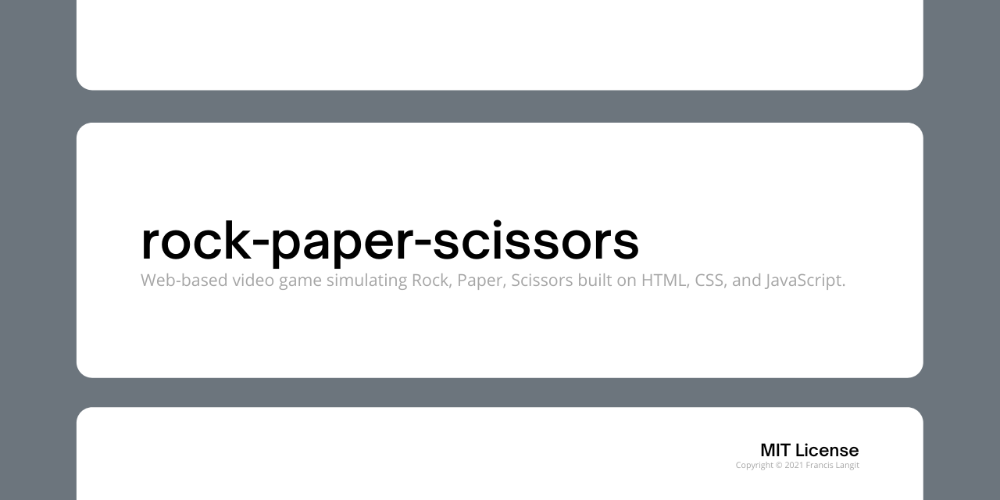
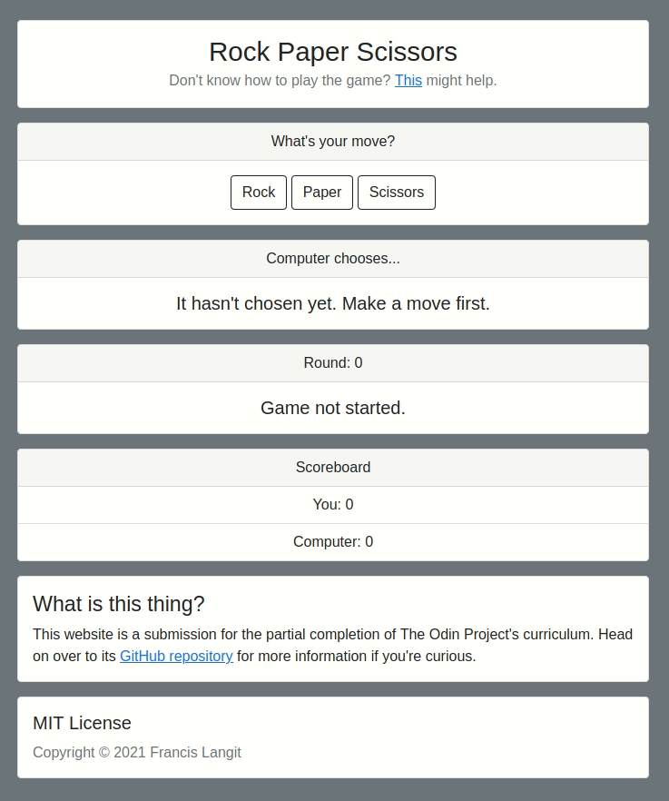

`rock-paper-scissors` is a web-based video game simulating Rock, Paper, Scissors built on HTML, CSS, and JavaScript. It was created in [partial completion of The Odin Project "Foundations" course](https://www.theodinproject.com/courses/foundations/lessons/rock-paper-scissors).

## Installation

[A live deployment of `rock-paper-scissors` is available here](#).

Otherwise, the following steps are for those that would like to run the website on their local computer and/or edit its source code. 

1. Clone the repository with `git clone https://github.com/FrancisLangit/rock-paper-scissors` or download it as a `.zip` file and extract it.
2. Navigate to where `rock-paper-scissors` is on your local machine and open up `index.html` on your preferred web browser.

## Usage

If you don't know how to play Rock, Paper, Scissors, [this](https://en.wikipedia.org/wiki/Rock_paper_scissors) Wikipedia article might help.

With that, as the description of this project suggests, the website simulates you playing the aforementioned game against a computer to a best of five.  One may start-off the first round by pressing any of the buttons under the "What's your move?" card.

## Contributing

This repository is currently not open to contribution. However, should one encounter a bug upon its usage, feel free to submit an issue detailing such.

## License

[MIT License](https://github.com/FrancisLangit/rock-paper-scissors/blob/main/LICENSE)